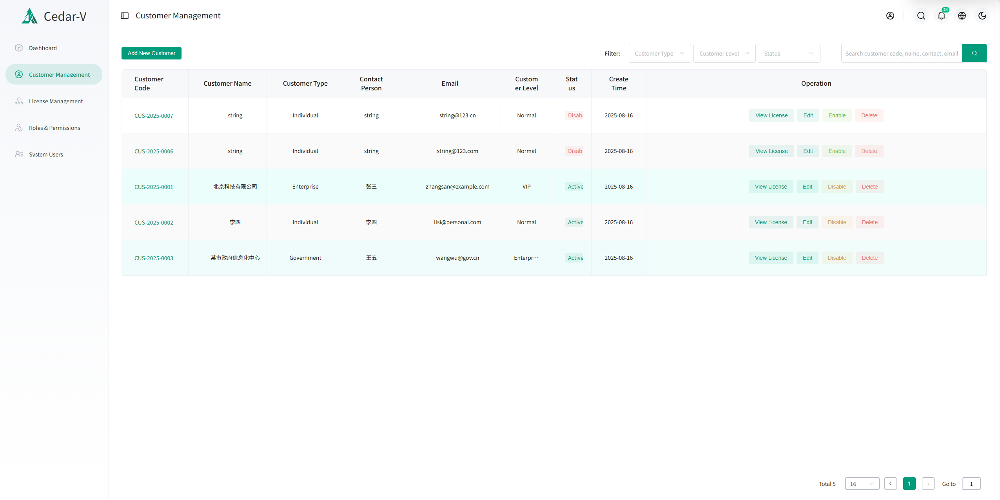

# 软件授权管理平台

<p align="center">
  <a href="https://github.com/cedar-v/license-manager/releases">
    
  </a>
  <a href="https://github.com/cedar-v/license-manager/releases">
    
  </a>
  <a href="LICENSE">
    
  </a>
  <a href="https://github.com/cedar-v/license-manager/issues">
    
  </a>
  <a href="https://github.com/cedar-v/license-manager/pulls">
    
  </a>
</p>

[中文](README.md) | [English](README_EN.md) 

---

## 项目概述

软件授权管理平台是一个独立的软件授权管理系统，为软件系统提供授权码生成、分发、验证和管理服务。支持在线和离线两种授权模式，基于硬件绑定的授权机制确保安全性。

✨同时支持**任何开发语言**、**任何类型的软件产品**通过标准化 **HTTP API** 与**跨平台客户端 SDK** **快速集成授权能力**。

## Demo环境
  <a href="https://lm.cedar-v.com:18080">
    
  </a>

访问地址：[lm.cedar-v.com:18080](http://lm.cedar-v.com:18080)  
**登录凭证：**  
- 用户名：`admin`  
- 密码：`admin@123`

> 💡 这是一个当前功能的演示环境，您可以体验已开发的核心特性。

## 官方文档

官方文档请访问：[https://docs.cedar-v.com](https://docs.lm.cedar-v.com)

## Star收藏与关注

<a href="https://github.com/cedar-v/license-manager" target="_blank">
  
</a>
<a href="https://github.com/cedar-v/license-manager" target="_blank">
  
</a>

如果这个项目对你有帮助，请给个star收藏，你的支持是我们最大的动力！

## 客户端SDK

客户端SDK请访问：[https://github.com/cedar-v/license-manager-sdk](https://github.com/cedar-v/license-manage-sdk-go)

## 商业咨询与合作

商业咨询与合作请联系QQ群管理员。

## 系统界面

### 登录界面


### 管理仪表盘


### 客户管理


### 许可证管理


客户管理模块提供完整的客户信息管理功能，包括客户信息的增删改查、状态管理、授权关联等核心功能。

## 核心功能

- 🔧 **客户管理**：完整的客户信息管理和状态控制
- 🔐 **授权生成**：在线/离线授权模式，支持硬件指纹绑定
- 📊 **授权管理**：实时状态监控和授权生命周期管理
- 📦 **部署包生成**：自动生成包含配置的部署包
- 🌐 **API服务**：提供验证、激活、心跳监控等RESTful API
- ⚙️ **系统管理**：管理员认证和监控仪表盘
- 🛠️ **跨平台工具**：多平台硬件信息获取工具

## 技术栈

- **前端**：Vue.js 3+ 配合现代化UI组件
- **后端**：Go 1.23+ 使用Gin框架、GORM、Viper配置和Logrus日志
- **数据库**：MySQL 8+
- **配置**：YAML格式配置文件
- **部署**：Docker、单机部署或系统服务

## 安全与性能

- **安全特性**：
  - JWT身份认证和授权机制
  - HMAC-SHA256签名验证  
  - 硬件指纹绑定防盗版
  - HTTPS传输加密
  - 多语言错误信息支持（中/英/日）
  
- **性能表现**：
  - **高并发**：Go原生协程支持，理论支持10,000+并发连接
  - **低延迟**：API平均响应时间 < 50ms
  - **内存优化**：Go GC优化，内存占用 < 100MB
  - **数据库连接池**：支持连接复用，最大化数据库性能
  
- **可靠性**：
  - 完善的错误处理和多语言错误信息
  - 结构化日志记录和监控
  - 自动数据库迁移
  - 优雅关闭和资源清理

## 安装部署

```bash
# 克隆项目
git clone https://github.com/cedar-v/license-manager.git
cd license-manager

# 本地后端构建与运行（可选）
cd backend/cmd
go build -o license-manager

# 配置（二选一）
# 1) 在当前目录创建配置文件（程序优先读取工作目录下的 config.yaml）
# cp ../configs/config.example.yaml ./config.yaml && 编辑
# 2) 直接编辑 ../configs/config.yaml（程序会自动回退读取该文件）

./license-manager
```
## 
## Docker 部署

### 使用预构建镜像（推荐）

如需快速部署且无需修改源码，可直接使用预构建的 GitHub Container Registry 镜像：

详细部署步骤请参考：[GitHub 镜像部署指南](docs/github-images-deploy.md)

### 从源码构建

推荐使用 Docker Compose，已提供开发与生产编排文件：

```bash
# 开发环境（首次建议带 --build）
docker compose up -d --build

# 生产环境
docker compose -f docker-compose.prod.yml up -d

# 验证后端健康
curl http://localhost:18888/health
```

完整部署说明（反向代理、健康检查、配置挂载等）请参见 `README-Docker.md`。

## 开源许可证

本项目采用 **GNU General Public License v3.0 (GPL-3.0)** 开源许可证。

### 许可证说明

- **自由使用**：您可以自由地使用、学习、修改和分发本软件
- **开源要求**：如果您分发修改版本，必须同样开源并采用GPL-3.0许可证
- **版权保护**：使用本软件的衍生作品必须保留原始版权声明
- **无担保**：软件按"现状"提供，不提供任何明示或暗示的担保

### 商业使用

- 允许商业使用，但衍生作品必须同样开源
- 如需专有许可证或商业支持，请联系项目维护者

### 许可证全文

详细许可证条款请查看项目根目录的 [LICENSE](LICENSE) 文件，或访问：
https://www.gnu.org/licenses/gpl-3.0.html


---

## 贡献

欢迎贡献代码！请随时提交Pull Request。

## 支持

### 用户反馈与交流

我们非常重视用户的反馈和建议！欢迎加入我们的QQ群进行讨论和交流：


扫描二维码或者搜索QQ群号加入，与其他用户和开发者一起：
- 分享使用经验和最佳实践
- 提出问题和获得帮助
- 参与新功能讨论
- 反馈问题和改进建议

### 问题报告

如有技术问题或Bug报告，请通过以下方式联系我们：
- 提交GitHub Issue（推荐）
- 在QQ群中反馈
- 发送邮件给项目维护者 