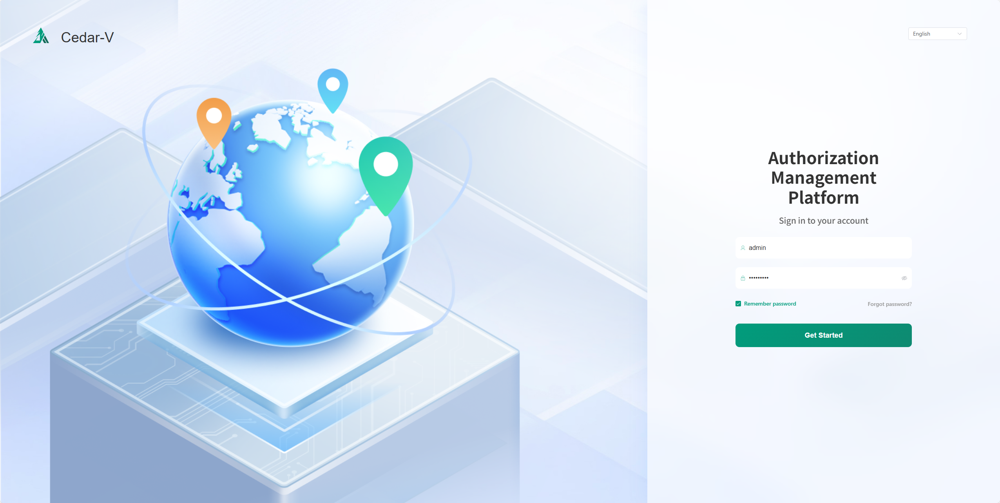
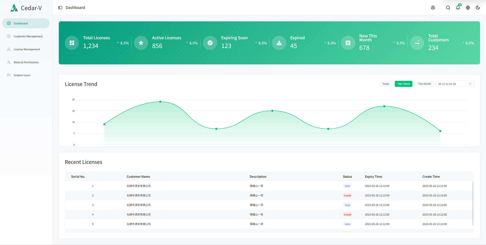

# License Manager

[中文](README.md) | [English](README_EN.md) 

---

## Overview

License Manager is an independent software licensing platform that provides license code generation, distribution, validation, and management services for IoT platforms and other software systems. It offers both online and offline licensing modes with hardware-based binding for enhanced security.

## Demo Environment

Access URL: [lm.cedar-v.com:18080](http://lm.cedar-v.com:18080)  
**Login Credentials:**  
- Username: `admin`  
- Password: `admin@123`

> 💡 This is a demo environment showcasing our current features. You can experience the implemented core functionalities while we continue active development with more features coming soon.

## System Interface

### Login Page


### Management Dashboard


### Customer Management


The customer management module provides comprehensive customer information management features, including CRUD operations for customer data, status management, and authorization associations.

## Key Features

- 🔧 **Customer Management**: Complete customer information management with status control
- 🔐 **License Generation**: Online/offline license modes with hardware fingerprinting
- 📊 **License Management**: Real-time status monitoring and license lifecycle management
- 📦 **Deployment Packages**: Automatic generation of deployment packages with configurations
- 🌐 **API Services**: RESTful APIs for validation, activation, and heartbeat monitoring
- ⚙️ **System Management**: Admin authentication and monitoring dashboard
- 🛠️ **Cross-platform Tools**: Hardware information extraction tools for multiple platforms

## Technical Stack

- **Frontend**: Vue.js 3+ with modern UI components
- **Backend**: Go 1.23+ with Gin framework, GORM, Viper configuration and Logrus logging
- **Database**: MySQL 8+
- **Configuration**: YAML format configuration files
- **Deployment**: Docker, single machine, or system service

## API Endpoints

```
POST /api/validate      - License validation
POST /api/activate      - License activation
POST /api/heartbeat     - Heartbeat reporting
GET  /api/license/{code} - License information query
GET  /api/customers     - Customer list API
GET  /tools/{tool}      - Tool download
```

## Security & Performance

- **Security Features**:
  - JWT authentication and authorization
  - HMAC-SHA256 signature verification
  - Hardware fingerprint binding for anti-piracy
  - HTTPS transport encryption
  - Multi-language error message support (Chinese/English/Japanese)
  
- **Performance**:
  - **High Concurrency**: Go native goroutines support, theoretically supports 10,000+ concurrent connections
  - **Low Latency**: Average API response time < 50ms
  - **Memory Optimized**: Go GC optimization, memory usage < 100MB
  - **Database Connection Pool**: Connection reuse for maximum database performance
  
- **Reliability**:
  - Comprehensive error handling with multi-language error messages
  - Structured logging and monitoring
  - Automatic database migrations
  - Graceful shutdown and resource cleanup

## Installation

```bash
# Clone the repository
git clone https://github.com/cedar-v/license-manager.git
cd license-manager

# Local backend build & run (optional)
cd backend/cmd
go build -o license-manager

# Configuration (choose one)
# 1) Create config.yaml in the working directory (the app looks here first)
#    cp ../configs/config.example.yaml ./config.yaml && edit it
# 2) Edit ../configs/config.yaml (the app will fall back to this path)

./license-manager
```

## Docker Deployment

We provide ready-to-use Docker Compose files for development and production:

```bash
# Development (first run with --build is recommended)
docker compose up -d --build

# Production
docker compose -f docker-compose.prod.yml up -d

# Verify backend health
curl http://localhost:18888/health
```

Notes
- Backend config is mounted by Compose:
  - Dev: `backend/configs/config.dev.yaml` → `/app/backend/cmd/config.yaml`
  - Prod: `backend/configs/config.prod.yaml` → `/app/backend/cmd/config.yaml`
- Frontend Nginx proxies `/api/` to `backend:18888` inside the Docker network.
- Health checks use `curl`; the backend image includes `curl`.
- For full details (reverse proxy, health checks, mounts, troubleshooting), see `README-Docker.md`.

## Open Source License

This project is licensed under the **GNU General Public License v3.0 (GPL-3.0)**.

### License Description

- **Free Use**: You are free to use, study, modify, and distribute this software
- **Open Source Requirement**: If you distribute modified versions, they must also be open source under GPL-3.0 license
- **Copyright Protection**: Derivative works using this software must retain the original copyright notice
- **No Warranty**: The software is provided "as is" without any express or implied warranty

### Commercial Use

- Commercial use is permitted, but derivative works must also be open source
- For proprietary licensing or commercial support, please contact the project maintainers

### Full License Text

For detailed license terms, please see the [LICENSE](LICENSE) file in the project root directory, or visit:
https://www.gnu.org/licenses/gpl-3.0.html

---

## Contributing

We welcome contributions! Please feel free to submit a Pull Request.

## Support

### User Feedback & Community

We highly value user feedback and suggestions! Join our QQ group for discussions and communication:


Scan the QR code or search for the QQ group number to join and connect with other users and developers to:
- Share usage experiences and best practices
- Ask questions and get help
- Participate in new feature discussions
- Provide feedback and improvement suggestions

### Issue Reporting

For technical issues or bug reports, please contact us through:
- Submit GitHub Issues (recommended)
- Provide feedback in the QQ group
- Send email to project maintainers