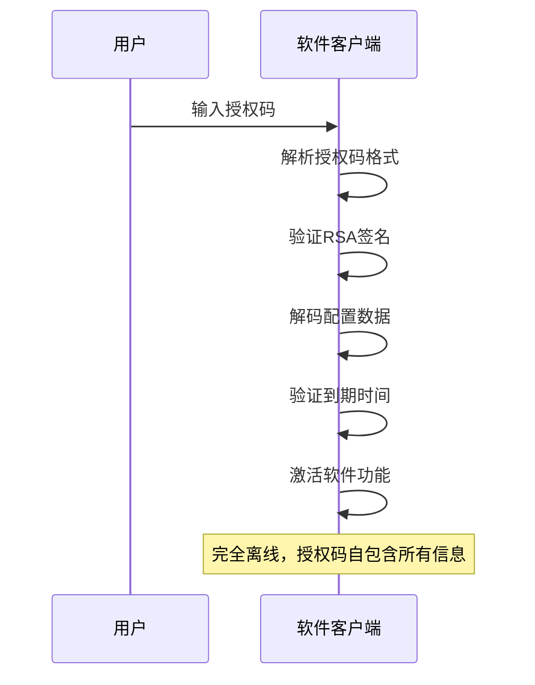

# 授权码生成规范变更

## 📋 需求背景

### 现状分析
- 当前授权码格式：`AC-260101-PQRSTUVW` (示例格式)
- 用户购买授权码后，需要在软件端激活使用
- 软件使用环境可能不联网，无法实时验证授权码有效性
- 当前授权码仅包含基本标识信息，缺少配置详情

### 业务痛点
1. **离线激活困难**：无网络环境无法验证授权码
2. **配置信息缺失**：授权码不包含功能配置、使用限制等详细信息
3. **用户体验不佳**：激活流程依赖网络连接
4. **格式不够友好**：授权码可读性差，不易识别

## 🎯 需求目标

### 核心目标
实现**离线激活授权码**，支持无网络环境下的软件激活和配置获取。

### 功能目标
1. **完整配置嵌入**：授权码包含所有必要配置信息
2. **加密签名保护**：通过数字签名确保授权码安全性
3. **离线验证支持**：软件端可独立验证授权码有效性
4. **友好格式设计**：提高授权码的可读性和识别性

## 🏗️ 技术方案设计

### 1. 授权码结构设计

#### 自包含式授权码
授权码本身包含完整的配置信息，通过编码和加密实现：

**授权码格式**：
```
LIC-{压缩编码的配置数据}-{校验码}
```

**生成步骤**：
1. 构建核心配置JSON
2. 进行数据压缩和编码
3. 添加RSA签名
4. 生成校验码
5. 格式化为用户友好的字符串

### 2. 数据编码方案

#### 核心配置数据
```json
{
  "ver": "1.0",
  "exp": "2026-12-31T23:59:59Z",
  "features": {
    "max_users": 100,
    "storage": "100GB"
  },
  "limits": {
    "type": "standard"
  },
  "params": {
    "company": "示例公司"
  }
}
```

#### 编码过程
1. **JSON序列化**：将配置转换为紧凑JSON格式
2. **数据压缩**：使用高效压缩算法减小体积
3. **Base64编码**：转换为安全字符集
4. **RSA签名**：对编码数据进行签名
5. **格式封装**：添加前缀和校验码

#### 解码过程
1. **格式解析**：提取编码数据部分
2. **签名验证**：验证RSA签名有效性
3. **数据解码**：Base64解码并解压缩
4. **配置提取**：解析JSON获取配置信息

### 3. 加密与签名

#### 密钥管理
- **私钥**: 与生成许可证使用相同的RSA私钥
- **公钥**: 软件客户端内置对应的RSA公钥
- **自动生成**: 如果密钥文件不存在，系统会自动生成RSA密钥对
- **数据签名**: 对编码后的配置数据进行RSA签名

#### 签名算法
- **算法**: RS256 (RSA + SHA256)
- **签名位置**: 签名数据嵌入到授权码中
- **验证方式**: 软件端提取并验证签名确保数据完整性

### 4. 激活流程设计

#### 完全离线激活流程


## 🔒 安全性考虑

### 加密保护
- **RSA签名**: 使用与许可证相同的私钥进行签名
- **数据完整性**: 防止配置信息被篡改
- **到期验证**: 确保授权码在有效期内使用

### 验证机制
- **格式校验**: 验证授权码格式规范
- **签名验证**: 强制验证RSA签名有效性
- **时间检查**: 验证到期时间未过期

## 📊 验收标准

### 功能验收
- [ ] 授权码自包含配置信息（到期时间、功能配置、使用限制、自定义参数）
- [ ] 授权码通过RSA签名确保数据完整性
- [ ] 软件端可完全离线解析和验证授权码
- [ ] 激活流程无需网络连接

### 安全性验收
- [ ] RSA签名验证通过率 100%
- [ ] 配置数据防篡改保护
- [ ] 到期时间验证准确
- [ ] 编码/解码过程可靠

## 🔧 简化实施计划

### 📋 当前实现分析

#### 现有架构保持不变
- **数据库结构**: 完全保持现有设计
- **业务逻辑**: 不改变现有流程
- **API接口**: 现有接口继续可用

#### 核心变化
- **授权码生成规则**: 从简单字符串改为自包含配置的编码字符串
- **新增工具包**: `pkg/license/codec.go` 提供编解码功能
- **字段长度调整**: `code` 字段长度从 100 调整到 1000 以容纳编码数据

### 🎯 简化的修改计划

#### 第一阶段：开发核心算法包
1. **扩展 `pkg/utils/license_codec.go`**
   - `EncodeLicenseData()`: 配置数据编码为授权码
   - `DecodeLicenseData()`: 从授权码解析配置数据
   - `SignLicenseData()`: RSA签名生成
   - `VerifyLicenseSignature()`: RSA签名验证

#### 第二阶段：修改授权码生成
1. **更新 `generateAuthorizationCode()` 方法**
   - 集成配置数据编码逻辑
   - 生成自包含的授权码字符串
   - 保持相同的调用接口

2. **调整数据库字段长度**
   - `code VARCHAR(100)` → `code VARCHAR(1000)`
   - 确保向后兼容现有短授权码

#### 第三阶段：完成授权码生成规则
1. **集成到现有流程**
   - 修改授权码生成服务
   - 保持现有API接口不变
   - 授权码自包含配置信息

### 📊 验收标准

#### 功能验收
- [ ] 授权码包含完整配置信息（到期时间、功能配置、使用限制、自定义参数）
- [ ] 授权码通过RSA签名确保数据完整性
- [ ] 授权码可被软件端离线解析和验证
- [ ] 保持与现有系统的完全兼容性

#### 性能验收
- [ ] 授权码生成时间 < 200ms (增加约50ms用于编码)
- [ ] 离线验证时间 < 100ms

#### 安全性验收
- [ ] RSA签名验证功能正常
- [ ] 配置数据防篡改保护

### 🔄 兼容性策略

#### 渐进式启用
- 默认保持原有生成方式（可配置开关）
- 新授权码采用自包含格式
- 现有授权码继续有效

### 📝 具体代码修改点

#### 1. 新增文件：`pkg/utils/license_codec.go`
```go
package utils

// 核心编解码和签名验证功能
func EncodeLicenseData(config interface{}) (string, error)
func DecodeLicenseData(code string) (interface{}, error)
func SignLicenseData(data []byte) (string, error)
func VerifyLicenseSignature(data []byte, signature string) error
```

#### 2. 修改文件：`authorization_code_service.go`
- 修改 `CreateAuthorizationCode()` 方法支持预生成授权码
- 添加 `PreGeneratedCode` 参数到请求结构
- 保持向后兼容性

#### 3. 修改文件：`cu_order_service.go`
- 修改订单创建流程生成自包含授权码
- 使用 `utils.EncodeLicenseData()` 生成授权码
- 传递预生成的授权码给授权码服务

#### 4. 修改文件：`003_create_authorization_codes_table.sql`
- 调整 `code VARCHAR(100)` → `code VARCHAR(1000)`


## 📝 附录

### 配置参数说明
- **end_date**: 到期时间
- **feature_config**: 功能特性配置
- **usage_limits**: 使用限制配置
- **custom_parameters**: 自定义业务参数 