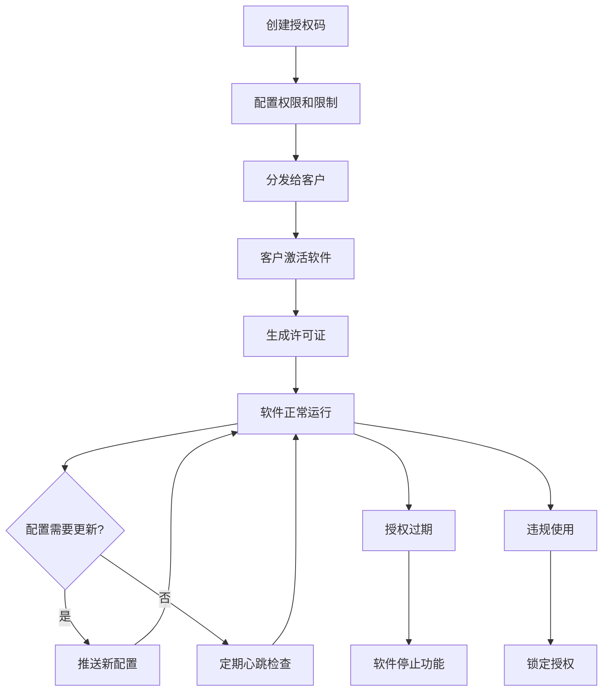
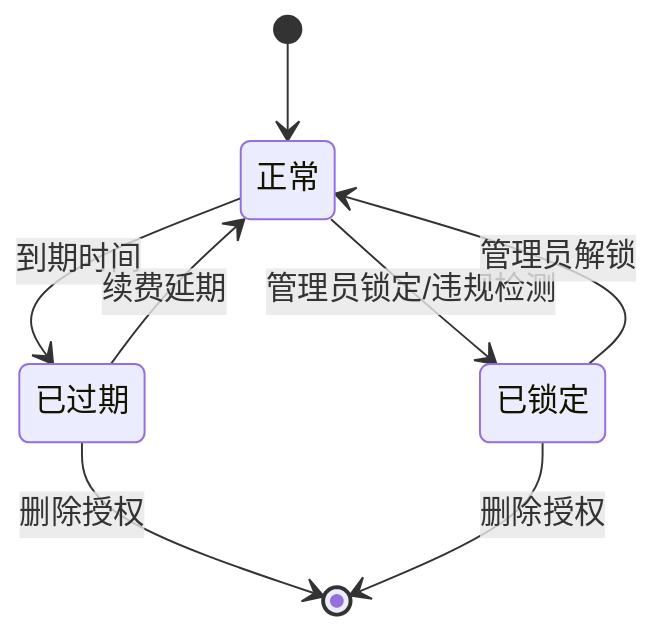
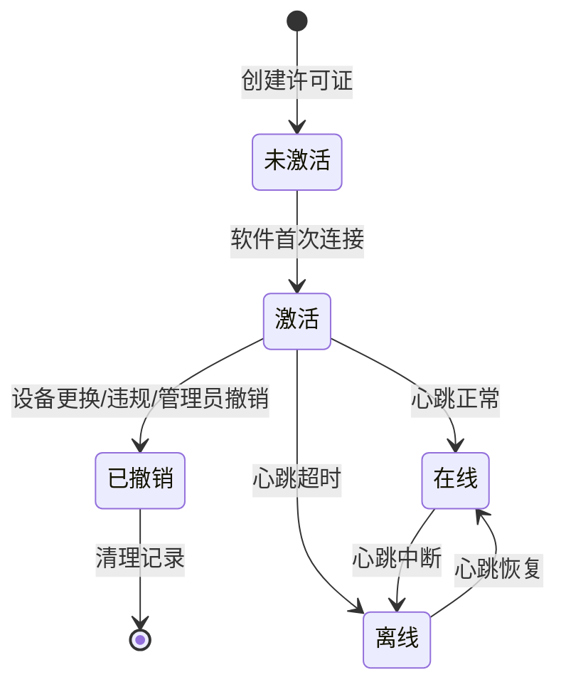

# 授权管理系统 - 产品原型设计方案

## 📋 文档概述

**目标用户**: 产品经理、UI/UX设计师
**文档目的**: 为授权管理系统的原型设计和交互设计提供详细指导
**适用范围**: 管理后台、客户端授权验证流程

---

## 🎯 产品定位

### 核心价值
- **统一授权管理** - 为多个软件产品提供统一的授权管理平台
- **灵活配置** - 支持不同软件的个性化授权规则
- **安全可靠** - 基于硬件指纹的防盗版机制
- **离线支持** - 许可证文件支持完全离线运行

### 目标用户群体
1. **系统管理员** - 管理授权码、监控使用情况
2. **销售人员** - 为客户创建和配置授权
3. **客服人员** - 处理客户授权问题和故障排查
4. **最终用户** - 软件激活和使用

---

## 🚀 核心业务流程

### 1. 授权码生命周期


---

## 📱 页面结构设计

### 导航结构

```
授权管理系统
├── 仪表板 (Dashboard)
│   ├── 概览统计
│   ├── 近期活动
│   └── 告警信息
├── 授权码管理
│   ├── 授权码列表
│   ├── 创建授权码
│   ├── 授权码详情
│   └── 批量操作
├── 许可证管理
│   ├── 许可证列表
│   ├── 许可证详情
│   ├── 手动添加许可证
│   └── 设备管理
├── 客户管理
│   ├── 客户列表
│   ├── 客户详情
│   └── 客户授权概览
├── 报表分析
│   ├── 使用情况统计
│   ├── 激活趋势分析
│   └── 收入分析
```

---

## 🎨 关键页面设计要求

### 1. 仪表板页面

**布局要求:**
- 采用卡片式布局，4列网格排列
- 顶部显示核心指标（总授权数、活跃许可证、过期警告等）
- 中部显示图表（激活趋势、使用情况分布）
- 底部显示近期活动日志

**核心指标卡片:**
```
┌─────────────┬─────────────┬─────────────┬─────────────┐
│ 总授权码数量 │ 活跃许可证   │ 即将过期     │ 异常告警     │
│   1,234    │    856     │     23     │      5      │
│ ↑ 5.2%     │ ↑ 3.1%     │ ↓ 12%      │ ↑ 2        │
└─────────────┴─────────────┴─────────────┴─────────────┘
```

**交互要求:**
- 指标卡片可点击跳转到详情页面
- 图表支持时间范围筛选（7天/30天/90天）
- 实时数据更新（每5分钟刷新）

### 2. 授权码管理页面

**列表页面字段:**
| 字段 | 显示名称 | 宽度 | 操作 |
|-----|---------|------|------|
| code | 授权码 | 120px | 复制 |
| customer_name | 客户名称 | 150px | 点击查看 |
| status | 状态 | 80px | 状态标签 |
| activated/max | 激活情况 | 100px | 进度条 |
| end_date | 到期时间 | 120px | 倒计时 |
| remark | 备注说明 | 100px | - |
| actions | 操作 | 120px | 按钮组 |

**状态标识设计:**
- 🟢 正常 (normal) - 绿色标签
- 🔒 已锁定 (locked) - 红色标签  
- ⏰ 已过期 (expired) - 灰色标签

**筛选器设计:**
```
┌─ 筛选条件 ────────────────────────────────────────┐
│ 客户: [下拉选择]  状态: [多选] │
│ 创建时间: [日期范围]  到期时间: [日期范围]        │
│ [重置] [搜索]                                   │
└─────────────────────────────────────────────────┘
```

### 3. 授权码详情页面

**页面布局:**
```
┌─ 基础信息 ─────────────────┬─ 配置信息 ─────────────────┐
│ 授权码: ABC123            │ 开始时间: 2024-01-01      │
│ 客户: 张三公司            │ 结束时间: 2024-12-31      │
│                         │ 最大激活数: 10            │
│ 状态: 🟢 正常            │ 当前激活: 7               │
│ 创建时间: 2024-01-01      │ 部署类型: 单机版          │
│ 创建人: 李四              │备注说明： xxxx
└───────────────────────────┴───────────────────────────┘

┌─ 功能配置 ─────────────────────────────────────────────┐
│ {                                                      │
│   "modules": ["user_mgmt", "inventory", "finance"],   │
│   "max_users": 100,                                   │
│   "api_calls_per_day": 10000                          │
│ }                                                      │
│ [编辑配置]                                             │
└───────────────────────────────────────────────────────┘

┌─ 许可证列表 ───────────────────────────────────────────┐
│ 设备1 | 192.168.1.100 | 最后心跳: 2分钟前 | 🟢在线    │
│ 设备2 | 192.168.1.101 | 最后心跳: 1小时前 | 🔴离线    │
│ 设备3 | 192.168.1.102 | 最后心跳: 5分钟前 | 🟢在线    │
│ [查看更多]                                             │
└───────────────────────────────────────────────────────┘
```

**操作按钮设计:**
- **主要操作:** [编辑配置] [延期续费] [导出许可证]
- **次要操作:** [锁定/解锁授权] [查看日志] [复制授权码]
- **危险操作:** [删除授权] - 需要二次确认

### 4. 创建授权码页面

**表单步骤设计:**
```
步骤1: 基础信息  →  步骤2: 授权配置  →  步骤3: 功能设置  →  步骤4: 确认创建
   🔵              ⚪              ⚪              ⚪
```

**授权码生成规则:**
- 格式: `LIC-{customer_code}-{random}-{checksum}`
- 示例: `LIC-COMP001-A7B9X2-C8F4`
- 由后端自动生成，确保唯一性和安全性

**步骤1 - 基础信息:**
```
┌─ 基础信息 ─────────────────────────────────────────┐
│ * 客户选择: [下拉搜索框] [+ 新建客户]              │
│   授权码: [提交后自动生成]                         │
│   备注说明: [多行文本框]                           │
└───────────────────────────────────────────────────┘
```

**步骤2 - 授权配置:**
```
┌─ 授权配置 ─────────────────────────────────────────┐
│ * 授权期限:                                        │
│   ○ 永久授权                                       │
│   ● 限期授权 时间范围 │
│                                                    │
│ * 最大激活数: [数字输入框] 台设备                  │
│                                                    │
│ * 部署类型:                                        │
│   ● 单机版  ○ 云端版  ○ 混合版                    │
│                                                    │
│   加密类型: ● 标准加密  ○ 高级加密                 │
└───────────────────────────────────────────────────┘
```

**步骤3 - 功能设置:**
```

MVP版本使用json编辑器即可
┌─ 功能模块 ─────────────────────────────────────────┐
│ [JSON编辑器或键值对编辑器]                         │
│ 键: [输入框]  值: [输入框]  [+ 添加]  [- 删除]    │
└───────────────────────────────────────────────────┘

┌─ 使用限制 ─────────────────────────────────────────┐
│ [JSON编辑器或键值对编辑器]                         │
│ 键: [输入框]  值: [输入框]  [+ 添加]  [- 删除]    │
└───────────────────────────────────────────────────┘

┌─ 自定义参数 ───────────────────────────────────────┐
│ [JSON编辑器或键值对编辑器]                         │
│ 键: [输入框]  值: [输入框]  [+ 添加]  [- 删除]    │
└───────────────────────────────────────────────────┘
```

### 5. 手动添加许可证页面

**适用场景:**
- 离线部署环境
- 客户提前提供硬件信息
- 批量部署前预生成许可证

**表单设计:**
```
┌─ 许可证信息 ───────────────────────────────────────┐
│ * 授权码: [下拉选择框 - 显示可用授权码]            │
│ * 硬件指纹: [文本输入框]                          │
│   示例: CPU:ABC123,MB:DEF456,MAC:00:11:22:33:44:55│
│                                                   │
│   设备信息: [JSON编辑器]   (可选)                        │
│   {                                               │
│     "cpu": "Intel i7-8700",                      │
│     "memory": "16GB",                             │
│     "disk": "512GB SSD",                         │
│     "os": "Windows 10 Pro"                       │
│   }                                               │
│                                                   │
│   激活IP: [IP输入框] (可选)                       │
│   备注: [多行文本框]                              │
│                                                   │
│               [取消] [生成许可证文件]              │
└───────────────────────────────────────────────────┘
```


**操作流程:**
```
[选择授权码] → [输入硬件信息] → [验证格式] → [生成许可证] → [下载许可证文件]
      ↓              ↓             ↓           ↓              ↓
  检查激活限制    解析硬件指纹    格式校验   更新数据库    提供文件下载
```

---

## 🔄 状态与交互流程

### 1. 授权状态流转



### 2. 许可证状态流转



### 3. 关键操作确认流程

**修改授权配置:**
```
[编辑配置] → [确认弹窗] → [填写变更信息] → [最终确认] → [执行修改]
                ↓              ↓
          确认修改对话框    变更类型选择
                          变更原因(可选)
```

**弹窗设计:**
```
┌─ 确认修改授权配置 ─────────────────────────────────────┐
│                                                       │
│ 您即将修改授权码 ABC123 的配置，此操作将影响          │
│ 7 个已激活的许可证设备。                              │
│                                                       │
│ * 变更类型:                                           │
│   ○ renewal续费  ○ upgrade升级  ○ limit_change限制调整│
│   ○ feature_toggle功能开关  ○ lock锁定  ○ unlock解锁  │
│   ○ other其他                                         │
│                                                       │
│   变更原因: [多行文本框 - 非必填]                     │
│   ┌─────────────────────────────────────────────────┐ │
│   │ 例如：客户要求增加用户数限制...                 │ │
│   │ 或填写锁定原因等自定义说明                      │ │
│   └─────────────────────────────────────────────────┘ │
│                                                       │
│                              [取消] [确认修改]       │
└───────────────────────────────────────────────────────┘
```


---

## 📊 数据展示要求

### 1. 列表页面分页

**分页控件要求:**
- 每页显示数量: 10/20/50/100 可选
- 页面跳转: 首页/上页/下页/末页 + 页码输入
- 总数显示: "共 1,234 条记录，第 1/25 页"

### 2. 日期时间显示

**标准格式:**
- 完整日期时间: 2024-01-01 14:30:25
- 相对时间: 2分钟前、1小时前、昨天、3天前
- 倒计时: 还有15天到期、已过期3天

### 3. 状态指示器

**在线状态:**
- 🟢 在线 (最近5分钟有心跳)
- 🟡 离线 (5分钟-24小时无心跳)  
- 🔴 异常 (24小时以上无心跳)

**进度指示:**
```
激活情况: 7/10  [████████▒▒] 70%
```


这份文档为产品经理和设计师提供了详细的原型设计指导，涵盖了用户流程、页面布局、交互细节和技术要求。可以基于这份文档进行原型制作和界面设计。